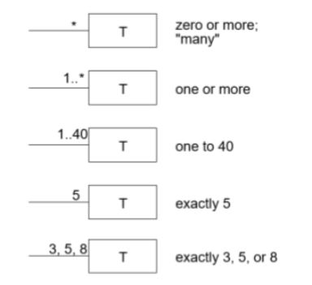

<<<<<<< HEAD
### Theory 
***

#### OOPS

Object oriented programming system is a methodolgy which help us to create a program using class and object.

#### Object
Object is an instance of a class, whenever class is defined, no memory is allocated but when object is initialized memory is allocated of that class.
#### Class
Class is a user defined datatype, which fields its own data member and member function in other words, we can say class is a collection of data member function, which can accessed and use by creating an object of that class.
=======
### Link your theory in here

 **Object Oriented Design**

* Object-oriented analysis is a method of analysis that examines requirements from the perspective of the classes and objects found in the vocabulary of the problem domain.

* Steps in examining requirements are:
    1. Use Case Document preparation.
    2. Object Model preparation.


**Use Case Document**

* A use case is a narrative description of a goal-oriented interaction between the system under development and an external agent.

* A use case is sort of like a dialog script written for two actors. Use cases capture requirements in the form of interactions with an end user.

```

Use Cases Do Not Require Technical Knowledge

```
* Main sections of a use case document are:

    * Use Case Name - Use Case naming is usually done based on an organization’s data standards.

    * Description


* Actors - The actors in the use case are the people or elements who are involved in the process

    * Primary Actor: person who is responsible for the event for which the Use Case exist
    * Secondary Actor: person or group of people that is needed to complete the process successfully

* Trigger: A trigger simply defines the exact action which results in the Use Case

    * External events are those started by an actor, either a person or another system requesting information.
    * Temporal events are those that are triggered or started by time.

* Preconditions: The conditions that need to be met to ensure that the use case can be fulfilled.

* Flow 
    * Types of flow
        
        * Basic Flow: best case scenario of what should happen in the use case if all the conditions are met.
        * Alternates: Are there any alternate routes that the action can be done?
        * Exceptions: This dictates what happens when a failure occurs in the flow.
    
    * Just one sentence writing style:
        * a sentence in the present tense,
        * with an active verb in the active voice,
        * describing an actor successfully achieving a goal that moves the process forward.

* Level: classify the use case with a level in order to explain the urgency which it needs to be dealt with: 
    * High Level Summary(white/cloud) -Enterprise level
    * Summary of goals (Kite) - business unit or department level
    * User Goal (Blue/ Sea level) - usually written for a business activity and each person should be able to do one blue level activity in anywhere from 2 to 20 minutes.
    * Sub-Function (Indigo/ fish) - shows lots of detail
    * Low Level (Black/calm) - most detailed use cases

* Post condition: It is the state of the system after the use case has finished, including output people have received, transmissions to other systems, and data that have been created or updated.
* Stakeholders: The people who are going to be affected by the use case.

**Domain Model**

* Domain modeling is a technique used to understand the project problem description and to translate the requirements of that project into software components of a solution.

* A domain model contains conceptual classes, associations between conceptual classes, and attributes of a conceptual class.

* "Informally, a conceptual class is an idea, thing, or object".

* Domain model is Is an Object and it has
    * identity,

    * state, and

    * behaviour.

* An object can be

    * related to other objects and

    * complex (with sub-objects).

* Identifying Objects

    
    * Modify or reuse an existing model.

    * Use a conceptual class category list.

    * Identify noun phrases.

* Making a domain model

    1. Identify conceptual classes

        * Conceptual class can be identified by studying the use case looking for relevant noun phrases

        * Some heuristics for identification are:

            * terms that developers or users need to clarify in order to understand the use case,

            * recurring nouns (higher frequency),

            * real world entities that the system needs to track,

            * real world activities

            * data sources or sinks

    2. Identify attributes (properties) to the classes

        * An attribute is a logical data (property) of an object (e.g., my eyes are hazel).

        * Most attributes can be represented by simple data types

        * Some heuristics for identifying attributes:

            * an attribute is part of the state of an object (a car's speed is 100 km/h, weight of a work item)

            * attributes are required by the use case (i.e., ignore irrelevant attributes).

    3. Draw the classes with only attribute
    4. Add any associations between classes
        * Some heuristics for identifying associations are:
            * examine verb phrases,

            *  ensure that the roles and association names are clear,

            *  only add an association if it improves the understanding of the domain,

            *  wait until the list of associations are stable before considering the multiplicity

                * Multiplicity defines how many instances of a class A can be associated with one instance of a class B.

                


>>>>>>> dev
